# Avatar Studio


[](https://github.com/ai-calypse/avatar-studio/actions/workflows/validate.yml) [](https://github.com/ai-calypse/avatar-studio/actions/workflows/codeql.yml)
Create a personalized robot avatar for your profile, team chat, app, or AI assistant. Avatar Studio combines a browser-based creator with a local MCP server so people and agents can generate avatars from the same accessory catalog.

Built on [Agent Robot Avatar by CX ArtLab](https://github.com/CX-ArtLab/agent-robot-avatar), using SVG and vanilla JavaScript. The website runs without a backend or account; the MCP server runs separately as a local Node.js subprocess.

[Live creator](https://ai-calypse.github.io/avatar-studio/) · [Documentation](https://ai-calypse.github.io/avatar-studio/docs/) · [Releases](https://github.com/ai-calypse/avatar-studio/releases) · [Changelog](CHANGELOG.md) · [npm package](https://www.npmjs.com/package/@ai-calypse/avatar-studio)

The documentation covers creator guides, npm integration, MCP setup, API controls, and visual use cases.

## Glossy 3D preview

The creator includes an optional **Glossy 3D** style with rounded vinyl bodies, reflective materials, raised eyes, and the existing shape-fitting accessory catalog. Switch styles in the editor; colors, eye controls, and body shapes carry over. Expression buttons control the 3D face directly, including heart eyes, happy arcs, sleeping eyes, and error crosses. PNG captures the transparent 3D view; GIF records the selected expression with floating and blinking motion. SVG retains the original vector appearance.

This first version requires browser WebGL. Devices without it keep the SVG editor. Reduced-motion preferences stop the floating motion. Accessory outlines curve around the actual body surface, and headphone bands and cushions fit the silhouette. Individually sculpted accessories and full gesture parity are future work. The npm component and local MCP image tools continue to render the existing SVG style.

The creator loads its self-hosted [Three.js](https://threejs.org/) renderer only when 3D is selected. For local development, `npm run dev` builds the renderer automatically; `npm run build:glossy` rebuilds it after changes. Three.js is MIT licensed; its license is included in the deployed bundle directory.

## Glossy 3D examples

Eight animated examples rendered with the creator’s actual **Glossy 3D** renderer: reflective vinyl bodies, shape-fitting accessories, fluid silhouettes, and different expressions. Click an animation to open its GIF, or download its transparent PNG. These are browser renders; the npm component and MCP exports currently use the 2D SVG style below.

| | | | |
| --- | --- | --- | --- |
| **Music lover**<br>[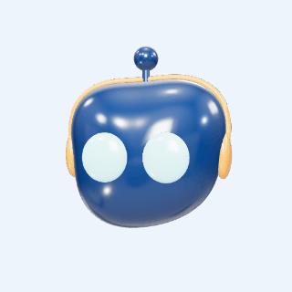](docs/examples/glossy/music.gif)<br>[PNG](docs/examples/glossy/music.png) | **Botanical love**<br>[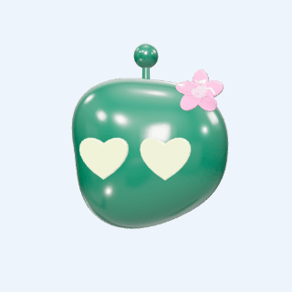](docs/examples/glossy/botanical.gif)<br>[PNG](docs/examples/glossy/botanical.png) | **Royal surprise**<br>[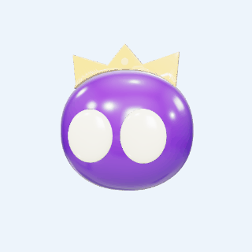](docs/examples/glossy/royal.gif)<br>[PNG](docs/examples/glossy/royal.png) | **Happy wizard**<br>[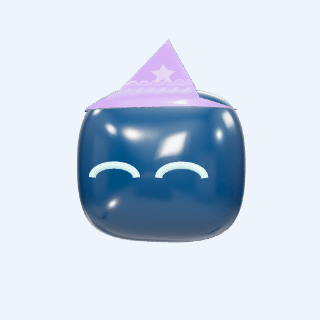](docs/examples/glossy/wizard.gif)<br>[PNG](docs/examples/glossy/wizard.png) |
| **Sleepy beanie**<br>[](docs/examples/glossy/sleepy.gif)<br>[PNG](docs/examples/glossy/sleepy.png) | **Curious fox**<br>[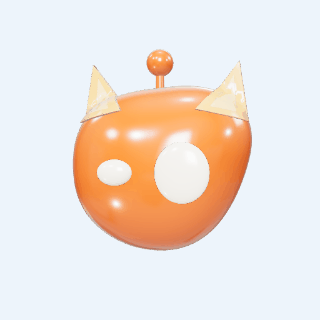](docs/examples/glossy/fox.gif)<br>[PNG](docs/examples/glossy/fox.png) | **Bookworm**<br>[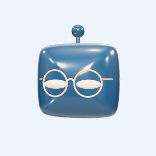](docs/examples/glossy/bookworm.gif)<br>[PNG](docs/examples/glossy/bookworm.png) | **Party hearts**<br>[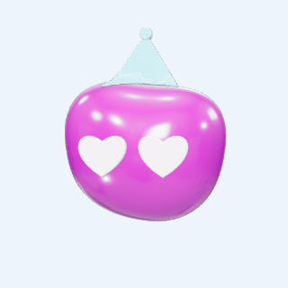](docs/examples/glossy/party.gif)<br>[PNG](docs/examples/glossy/party.png) |

Try **Glossy 3D** in the [live creator](https://ai-calypse.github.io/avatar-studio/). The [glossy example manifest](docs/examples/glossy/manifest.json) records each design, expression, and shape seed. To regenerate these assets from a local checkout, install the development dependencies and Playwright Chromium, then run `node scripts/build-glossy-examples.mjs`. For smaller GIF files with adaptive color palettes, run `python3 scripts/optimize-glossy-examples.py` afterward (requires Pillow).

## Avatar examples

Try the [live creator](https://ai-calypse.github.io/avatar-studio/) or use MCP to make your own. These **24 GIF examples were generated through the Avatar Studio MCP server**, using different colors, accessories, expressions, classic and seeded fluid bodies, and profile badges. Each preview links to its downloadable GIF.

MCP GIFs use a deterministic blink cycle with a selected expression. Sleeping eyes stay closed. For full actions, cursor following, and gestures, embed the live npm component.

| | | | |
| --- | --- | --- | --- |
| **Classic square**<br>[](docs/examples/classic.gif) | **Music lover**<br>[](docs/examples/music.gif) | **Royal surprise**<br>[](docs/examples/royal.gif) | **Fluid fox**<br>[](docs/examples/fox.gif) |
| **Wizard**<br>[](docs/examples/wizard.gif) | **Botanical**<br>[](docs/examples/botanical.gif) | **Sleepy beanie**<br>[](docs/examples/sleepy.gif) | **Cyber visor**<br>[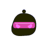](docs/examples/cyber.gif) |
| **Bookworm**<br>[](docs/examples/bookworm.gif) | **Party time**<br>[](docs/examples/party.gif) | **Fluid bunny**<br>[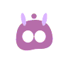](docs/examples/bunny.gif) | **Cowboy**<br>[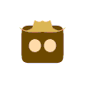](docs/examples/cowboy.gif) |
| **Chef**<br>[](docs/examples/chef.gif) | **Pirate**<br>[](docs/examples/pirate.gif) | **Little angel**<br>[](docs/examples/angel.gif) | **Tiny trouble**<br>[](docs/examples/devil.gif) |
| **Winter scarf**<br>[](docs/examples/winter.gif) | **Graduate**<br>[](docs/examples/graduate.gif) | **Fluid bear**<br>[](docs/examples/bear.gif) | **Alien signal**<br>[](docs/examples/alien.gif) |
| **Top hat**<br>[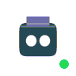](docs/examples/gentleman.gif) | **Lightning hero**<br>[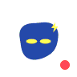](docs/examples/hero.gif) | **Heart glasses**<br>[](docs/examples/valentine.gif) | **Space goggles**<br>[](docs/examples/space.gif) |

### SVG, PNG, and sprite examples

The same designs can be exported as transparent SVGs, profile PNGs, or sprite sheets with frame coordinates.

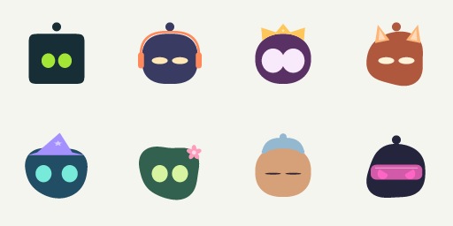

[Classic SVG](docs/examples/classic.svg) · [Headphones SVG](docs/examples/music.svg) · [Crown SVG](docs/examples/royal.svg) · [Fluid fox SVG](docs/examples/fox.svg) · [Wizard SVG](docs/examples/wizard.svg) · [Flower SVG](docs/examples/botanical.svg) · [Sleeping SVG](docs/examples/sleepy.svg) · [Visor SVG](docs/examples/cyber.svg)

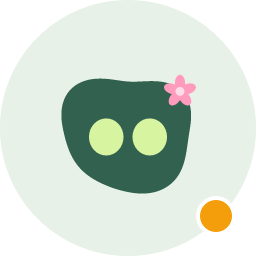

Reproduce the GIFs using the exact `create_avatar` arguments in [the example manifest](docs/examples/manifest.json). See [sprite coordinates and configs](docs/examples/sprite-manifest.json) for the PNG sheet. All assets are committed to this repository; no external image host is required.

## Avatars in real applications

**48 illustrated use cases**, from account profiles to agent workflows. These are documentation mockups made with real avatar exports, not bundled integrations. Your application supplies messaging, presence, notifications, accounts, game logic, and state transitions. Platform support for animated profile images varies; use PNG when GIF is not supported.

### Profiles and communities

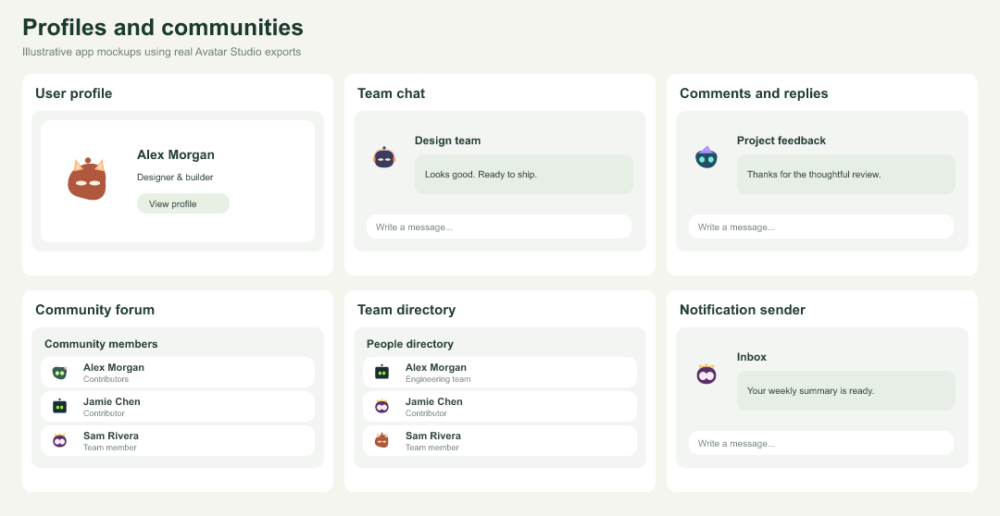

| Example | How to use it | Tool or export |
| --- | --- | --- |
| [User profile](docs/use-cases/user-profile.svg) | Your own recognizable account picture. | `create_avatar` |
| [Team chat](docs/use-cases/team-chat.svg) | Recognizable faces beside every message. | `create_avatar_batch` |
| [Comments and replies](docs/use-cases/comments.svg) | Give authors a consistent identity. | `generate_identity` |
| [Community forum](docs/use-cases/forum.svg) | Pseudonymous profiles without photo uploads. | `generate_identity` |
| [Team directory](docs/use-cases/directory.svg) | Create a coordinated set of team avatars. | `create_avatar_batch` |
| [Notification sender](docs/use-cases/notifications.svg) | Distinguish people, bots, and app events. | `create_avatar` |

### Assistants and support

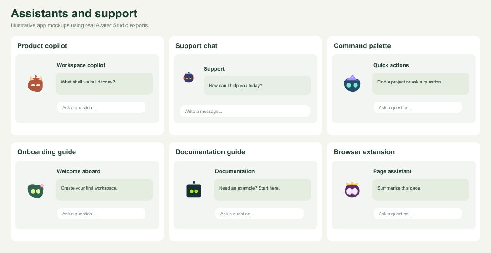

| Example | How to use it | Tool or export |
| --- | --- | --- |
| [Product copilot](docs/use-cases/copilot.svg) | Embed a companion beside useful suggestions. | `create_avatar_component` |
| [Support chat](docs/use-cases/support.svg) | Use a friendly identity for support agents. | `create_avatar_component` |
| [Command palette](docs/use-cases/command.svg) | Give your in-app assistant a face. | `npm component` |
| [Onboarding guide](docs/use-cases/onboarding.svg) | Explain the next step with a character. | `create_expression_pack` |
| [Documentation guide](docs/use-cases/docs-guide.svg) | Add a recognizable guide to documentation. | `npm component` |
| [Browser extension](docs/use-cases/extension.svg) | Fit a tiny helper into an extension popup. | `npm component` |

### Presence and workflow states

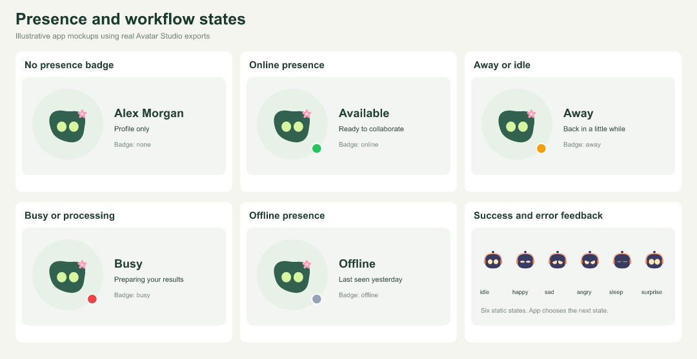

| Example | How to use it | Tool or export |
| --- | --- | --- |
| [No presence badge](docs/use-cases/neutral.svg) | Use the avatar without a state indicator. | `create_avatar` |
| [Online presence](docs/use-cases/online.svg) | Show an available person or assistant. | `create_avatar` |
| [Away or idle](docs/use-cases/away.svg) | Show a temporary absence with a badge. | `create_avatar` |
| [Busy or processing](docs/use-cases/busy.svg) | Show an agent working on a request. | `create_avatar` |
| [Offline presence](docs/use-cases/offline.svg) | Keep unavailable users visible in a roster. | `create_avatar` |
| [Success and error feedback](docs/use-cases/outcomes.svg) | Map avatar expressions to app outcomes. | `create_expression_pack` |

### Collaboration and work

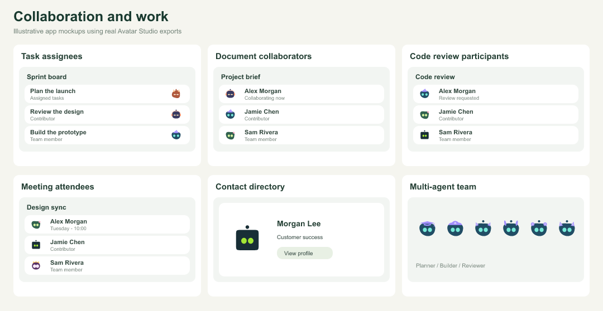

| Example | How to use it | Tool or export |
| --- | --- | --- |
| [Task assignees](docs/use-cases/kanban.svg) | Identify owners on a project board. | `create_avatar_batch` |
| [Document collaborators](docs/use-cases/editors.svg) | Show people currently editing a document. | `create_avatar_batch` |
| [Code review participants](docs/use-cases/reviewers.svg) | Show authors and reviewers near changes. | `generate_identity` |
| [Meeting attendees](docs/use-cases/calendar.svg) | Represent invitees in calendar events. | `create_avatar_batch` |
| [Contact directory](docs/use-cases/crm.svg) | Give contact records a default identity. | `generate_identity` |
| [Multi-agent team](docs/use-cases/agent-team.svg) | Differentiate agents while preserving brand colors. | `create_avatar_variants` |

### Branding and product identity

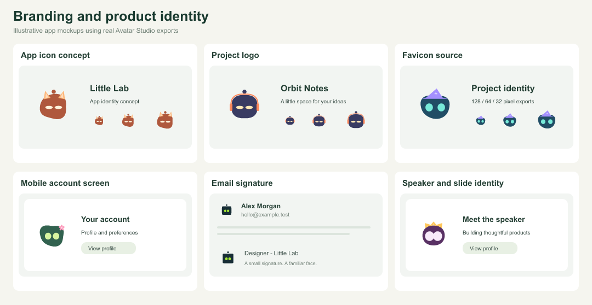

| Example | How to use it | Tool or export |
| --- | --- | --- |
| [App icon concept](docs/use-cases/app-icon.svg) | Start an icon design from a robot mascot. | `create_avatar` |
| [Project logo](docs/use-cases/project-logo.svg) | Give side projects an expressive visual mark. | `create_avatar` |
| [Favicon source](docs/use-cases/favicon.svg) | Export SVG or PNG as a favicon source. | `create_avatar` |
| [Mobile account screen](docs/use-cases/mobile.svg) | Use exported assets in a native app. | `create_avatar` |
| [Email signature](docs/use-cases/email.svg) | Add a personal mark to your signature. | `SVG / PNG export` |
| [Speaker and slide identity](docs/use-cases/slides.svg) | Use a consistent avatar in presentations. | `SVG / PNG export` |

### Content and community identity

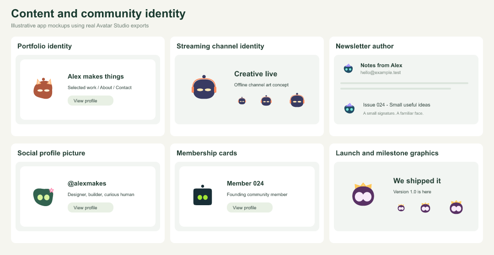

| Example | How to use it | Tool or export |
| --- | --- | --- |
| [Portfolio identity](docs/use-cases/portfolio.svg) | Carry your avatar across a personal site. | `SVG / PNG export` |
| [Streaming channel identity](docs/use-cases/stream.svg) | Use an avatar as a channel identity asset. | `GIF / PNG export` |
| [Newsletter author](docs/use-cases/newsletter.svg) | Show the author in newsletter headers. | `PNG export` |
| [Social profile picture](docs/use-cases/social.svg) | Upload a profile image where supported. | `PNG export` |
| [Membership cards](docs/use-cases/members.svg) | Personalize fictional community member cards. | `create_avatar_batch` |
| [Launch and milestone graphics](docs/use-cases/launch.svg) | Add a mascot to launch announcements. | `SVG / GIF export` |

### Games and learning

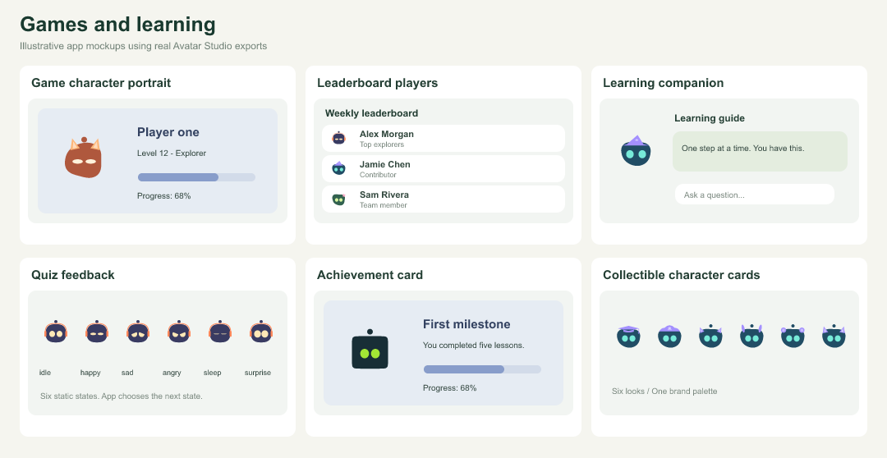

| Example | How to use it | Tool or export |
| --- | --- | --- |
| [Game character portrait](docs/use-cases/character.svg) | Give players a customizable portrait. | `create_avatar` |
| [Leaderboard players](docs/use-cases/leaderboard.svg) | Use repeatable avatars beside player scores. | `generate_identity` |
| [Learning companion](docs/use-cases/tutor.svg) | Add a character beside lesson guidance. | `create_avatar_component` |
| [Quiz feedback](docs/use-cases/quiz.svg) | Celebrate answers or show retry feedback. | `create_expression_pack` |
| [Achievement card](docs/use-cases/achievement.svg) | Personalize an achievement illustration. | `create_avatar` |
| [Collectible character cards](docs/use-cases/collectibles.svg) | Generate visual character collections. | `create_avatar_variants` |

### Developer and agent workflows

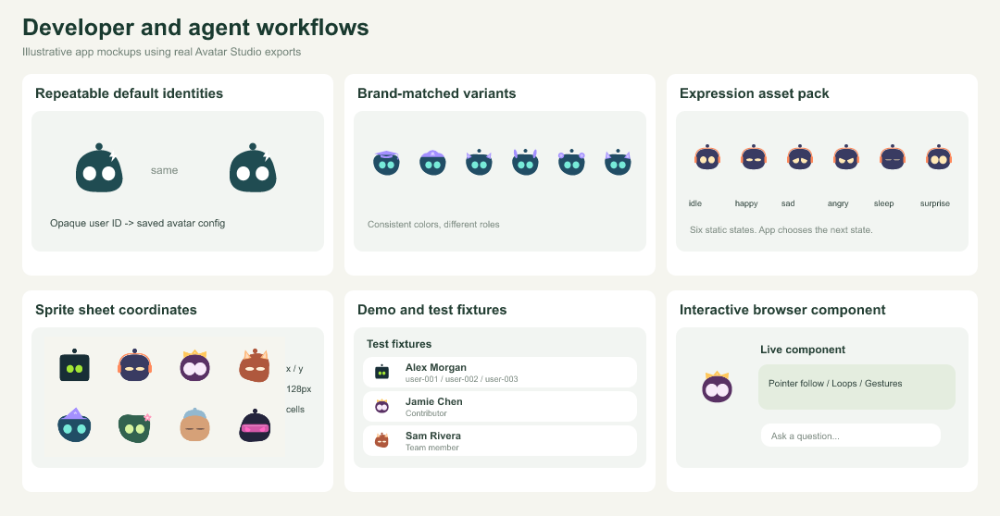

| Example | How to use it | Tool or export |
| --- | --- | --- |
| [Repeatable default identities](docs/use-cases/identicons.svg) | Generate a stable look from an opaque ID. | `generate_identity` |
| [Brand-matched variants](docs/use-cases/brand-kit.svg) | Keep colors fixed while varying accessories. | `suggest_brand_palette + create_avatar_variants` |
| [Expression asset pack](docs/use-cases/expression-pack.svg) | Export six named states for app logic. | `create_expression_pack` |
| [Sprite sheet coordinates](docs/use-cases/sprites.svg) | Use frame coordinates in canvas or games. | `create_sprite_sheet` |
| [Demo and test fixtures](docs/use-cases/fixtures.svg) | Create named users for mock interfaces. | `create_avatar_batch` |
| [Interactive browser component](docs/use-cases/interactive.svg) | Generate npm integration code for live controls. | `create_avatar_component` |

### Choose an integration

| Need | Use |
| --- | --- |
| A profile picture, logo, signature, slide, or native app asset | Website SVG/PNG/GIF downloads, npm `exportAvatar`, or MCP `create_avatar`. |
| Animated browser avatars with actions, cursor following, gestures, and looping | npm `configureAvatar` or MCP `create_avatar_component` for integration code. |
| Named users or a team set | `create_avatar_batch`. |
| Repeatable default avatars | `generate_identity`; pass an opaque ID and persist its returned config. It is not authentication or an anonymity guarantee. |
| A consistent brand palette and variations | `suggest_brand_palette` then `create_avatar_variants`. |
| Six image poses for application states | `create_expression_pack`; your app controls when to display each pose. |
| A canvas/game atlas with frame coordinates | `create_sprite_sheet`; the app implements rendering and animation. |
| Discover controls or validate agent-generated settings | `get_capabilities`, `list_accessories`, and `validate_avatar`. |

See the [MCP-generated live component configuration](docs/use-cases/assets/interactive-component.json) for looping, pointer-following, and antenna flash settings. Source: [48 use-case definitions](docs/use-cases/manifest.json), [MCP export metadata](docs/use-cases/assets/manifest.json), and [the gallery builder](scripts/build-use-case-gallery.mjs). After installing MCP dependencies, run `node scripts/build-use-case-gallery.mjs` to rebuild the mockups. PNG previews are committed so GitHub can display them directly.

## Run the website

Requires Node.js 22 or newer and npm.

```sh
git clone https://github.com/ai-calypse/avatar-studio.git
cd avatar-studio
npm ci
npm run dev
```

Open [Avatar Studio locally](http://127.0.0.1:4173/demo/?lang=en). To use another port:

```sh
npm run dev -- --port 4175
```

The creator opens immediately, with a live preview and downloads alongside the customization controls:

- Choose body, eye, and accessory colors independently, or enable **Match eyes** for the accessory.
- Adjust eye size, eye spacing, and head roundness. Choose **Fluid / random** for an organic body, then **Shuffle** to find a unique silhouette. Your shape seed is saved with your look.
- Choose from **50 accessories**, plus None, in a grouped dropdown. Accessories fit the changing body outline.
- Choose the header language to translate controls, all 50 accessories, showcases, and download messages into English, Spanish, French, German, Portuguese, Japanese, Korean, Simplified Chinese, or Traditional Chinese. The URL and browser remember your selection.
- Try expressions and movement settings, including blinking, pointer following, and interactive head movement.
- See your avatar in live examples of chat, profile cards, an app companion, and project branding.

Your appearance settings are saved in your browser. **Reset look** restores the defaults.

### Download formats

| Format | Website export |
| --- | --- |
| SVG | Transparent vector snapshot of the current appearance. |
| PNG | Transparent 512 × 512 image. |
| GIF | 24-frame, 256 × 256 looping recording, with a light background and reduced color palette. |

Exports are generated in the browser. SVG and PNG capture the current appearance; GIF records the live animation.

### Build for static hosting

```sh
npm run build:pages
```

Upload the contents of `.pages-site/` to your static host. The generated `index.html` serves the creator at the site root. This build contains only the website; it does not deploy or expose the MCP server.

## Connect the MCP server

The local MCP server provides **11 tools** for stable user identities, brand palettes, batch exports, design variants, expression packs, sprite sheets, and SVG/PNG/GIF generation. It shares the website's accessory catalog and shape-fitting accessory renderer. It uses predefined expressions and a deterministic blink animation rather than recording the browser's live state.

From the repository checkout, install its separate dependencies and verify the server:

```sh
npm ci --prefix mcp --ignore-scripts
npm run test:mcp
```

Add the following entry to your MCP client's configuration. Replace both absolute paths with your Node executable and this repository's location. Run `command -v node` to find Node; your client may use a different configuration format.

```json
{
  "mcpServers": {
    "avatar-studio": {
      "command": "/absolute/path/to/node",
      "args": [
        "--max-old-space-size=192",
        "/absolute/path/to/avatar-studio/mcp/src/index.mjs"
      ],
      "env": {}
    }
  }
}
```

Restart or reconnect your MCP client after saving its configuration. The client launches and manages the server process. No API key, HTTP URL, or separate website process is required.

`npm run mcp:start` also starts the server manually, but it speaks MCP over stdin/stdout and needs an MCP client attached. It does not start a web server or interactive command prompt.

### Available tools

| Tool | Arguments | Result |
| --- | --- | --- |
| `list_accessories` | `{}` for the full catalog, or an optional `category` returned by the catalog. | Accessory IDs and names grouped by category, plus generation limits. |
| `validate_avatar` | `{ "config": { ... } }` | Validated configuration with defaults applied. |
| `create_avatar` | `{ "format": "svg", "size": 256, "config": { ... } }` | Avatar artifact and metadata. |
| `get_capabilities` | `{}` | Supported formats, limits, expressions, and recommended workflows. |
| `generate_identity` | `{ "seed": "user-2048", "overrides": { ... } }` | Repeatable avatar config for a stable opaque user ID. |
| `suggest_brand_palette` | `{ "primary": "#738b3b", "mode": "dark" }` | Suggested config and measured color contrast. |
| `create_avatar_batch` | Named `items`, common `format`, `size`, and optional `presentation`. | Up to 12 files and an ordered manifest for teams or app fixtures. |
| `create_avatar_variants` | `config`, `seed`, `count`, and `vary`. | Up to 12 alternatives; preserve brand colors with `vary: "accessories"`. |
| `create_expression_pack` | `config` and optional `expressions`. | Matching images for idle, happy, sad, angry, sleep, and surprise states. |
| `create_sprite_sheet` | Named `items`, `columns`, and `cellSize`. | One SVG/PNG sheet with frame coordinates, at most 512 × 512. |

For example: “Create six branded support agents,” “Make a repeatable profile avatar for user-2048,” or “Build a sprite sheet of my guide's expressions.” See [workflow examples](mcp/README.md#tools-and-real-use-cases) for exact arguments.

Render tools also accept `presentation` for a hex/transparent background, circular or rounded frame, 0–24% padding, and an online/away/busy/offline status badge. The npm `exportAvatar` helper supports the same presentation controls. Batch/variant/expression tools produce SVG/PNG at 32–256 pixels; single-avatar generation retains SVG/PNG/GIF support. Results stay in memory and your app owns storage.


For example, ask your connected agent:

> Use Avatar Studio to create a dark green robot profile avatar with lime eyes and headphones that match the eyes. Return a 256-pixel PNG.

The corresponding `create_avatar` arguments are:

```json
{
  "format": "png",
  "size": 256,
  "config": {
    "body": "#182725",
    "eyes": "#dbf59d",
    "accessory": "headphones",
    "accessoryColor": "#ffffff",
    "matchEyes": true,
    "eyeSize": 100,
    "spacing": 0,
    "headRoundness": 70,
    "expression": "happy"
  }
}
```

### Configuration controls

All configuration fields are optional; omitted fields use the defaults below. Unknown fields are rejected.

| Field | Accepted values | Default |
| --- | --- | --- |
| `body` | Six-digit hex color, such as `#182725`. | `#08090b` |
| `eyes` | Six-digit hex color. | `#ffffff` |
| `accessoryColor` | Six-digit hex color; used when `matchEyes` is false. | `#ffffff` |
| `matchEyes` | Boolean; use the eye color for the accessory. | `false` |
| `accessory` | An ID returned by `list_accessories`, or `none`. | `none` |
| `eyeSize` | Number from 60 to 125. | `100` |
| `spacing` | Number from −12 to 12. | `0` |
| `bodyShape` | `classic` (square-to-circle) or `random` (fluid silhouette). | `classic` |
| `shapeSeed` | Integer from 0 to 4294967295; repeats the same fluid shape. | `0` |
| `headRoundness` | Number from 0 to 100. | `50` |
| `expression` | `idle`, `happy`, `sad`, `angry`, `sleep`, or `surprise`. | `idle` |

`format` defaults to `svg`, and `size` defaults to `256`. SVG and PNG accept integer sizes from 32 to 512. **For GIF, explicitly set `size` between 32 and 128**:

```json
{
  "format": "gif",
  "size": 128,
  "config": { "accessory": "wizard", "expression": "happy" }
}
```

MCP GIFs contain 12 looping blink frames at 100 ms per frame, with a light background and reduced color palette. SVG and PNG have transparent backgrounds by default; set `presentation.background` for a solid background.

### Use artifacts in your application

The result's `structuredContent` includes the normalized configuration, format, size, MIME type, byte count, and SHA-256 checksum. The artifact is returned in `content`:

- **SVG:** embedded resource with the SVG string in `resource.text`.
- **PNG:** image block with base64 data in `data`.
- **GIF:** embedded resource with base64 data in `resource.blob`.

Decode the returned data and save it through your application's authorized storage layer. Retain the normalized configuration to regenerate the avatar later. An `avatar://generated/...` resource URI identifies the returned artifact; it is not a hosted download URL or a stored resource to fetch. The MCP server does not save files.

See [the MCP guide](mcp/README.md) for more details and [the example client configuration](mcp/client-config.example.json).

### Security model

The MCP server is designed for a trusted MCP client launching a local subprocess. It has no network listener and exposes no file, shell, URL-fetching, or arbitrary SVG tools.

Inputs use strict allowlisted schemas. Rendering has bounded image sizes, output sizes, concurrency, and execution time, with separate workers that receive no inherited environment variables. Dependencies are pinned in a lockfile.

These controls do not make the process an operating-system sandbox or a public multi-tenant service. Read [the security model and limitations](mcp/SECURITY.md) before integrating or hosting it. Remote access would require a separate authentication, isolation, and deployment design.

## npm package for applications

The browser package is **`@ai-calypse/avatar-studio`**. It includes the animated robot and cat components, the 50-accessory catalog, programmatic customization, and SVG snapshots with TypeScript declarations. It has no runtime dependencies. The website controls and Node.js MCP server are separate.

Install the published package from [npm](https://www.npmjs.com/package/@ai-calypse/avatar-studio):

```sh
npm install @ai-calypse/avatar-studio
```

Import it in your browser application's entrypoint:

```js
import { customizeAvatar, exportAvatarSVG, accessories } from '@ai-calypse/avatar-studio';

const avatar = document.createElement('agent-robot-avatar');
avatar.setAttribute('size', '160');
document.querySelector('#avatar-container').appendChild(avatar);

customizeAvatar(avatar, {
  body: '#182725',
  eyes: '#dbf59d',
  accessory: 'headphones',
  matchEyes: true,
  headRoundness: 70,
  bodyShape: 'random',
  shapeSeed: 42
});

avatar.startWaiting();
// When your operation completes:
await avatar.play('success');

const svg = exportAvatarSVG(avatar, 256);
console.log(accessories); // 50 entries with id, name, and category
```

Call `customizeAvatar` after attaching the element to the page. It accepts partial appearance updates using the color, accessory, eye-size, spacing, and head-roundness controls listed above. Unsupported fields, accessory IDs, and out-of-range values are rejected. Set expressions through the component's animation API, such as `avatar.play('success')`; the MCP-only `expression` field is not accepted by `customizeAvatar`. With `bodyShape: "random"`, the same `shapeSeed` and `headRoundness` reproduce the same silhouette in the browser and MCP. Roundness still controls the underlying softness; changing the seed changes the outline. The shape stays stable while blinking, dragging, and exporting. Shape uniqueness is visual variety, not an authentication guarantee. Settings are isolated per element and are not automatically saved to browser storage.

`exportAvatarSVG` returns a string snapshot of the current pose at a size from 32 to 512. Use `exportAvatar` for browser SVG/PNG/GIF Blobs, the website downloads, or MCP for generated artifacts. In a server-rendered application, create and customize elements on the client after mounting.

To test local changes before publishing a new version, install from a local tarball:

```sh
npm pack --pack-destination /tmp
# Run in your application's directory:
npm install /tmp/ai-calypse-avatar-studio-0.2.0.tgz
```

See [the basic example](examples/basic.html), [the accessible request lifecycle example](examples/accessibility.html), and [TypeScript declarations](index.d.ts) for the underlying component API. [Publishing instructions](RELEASING.md) explain npm login, validation, and release automation.

## Complete control API (npm 0.2.0+)

```js
import { configureAvatar, exportAvatar, avatarActions } from '@ai-calypse/avatar-studio';

// Attach the component before configuring it.
configureAvatar(avatar, {
  appearance: { bodyShape: 'random', shapeSeed: 42, antenna: true,
    accessory: 'headphones', matchEyes: true, eyes: '#dbf59d' },
  behavior: { pointerFollow: true, antennaFlash: true, loop: true,
    pressSqueeze: true, antennaDrag: true, motion: 'auto',
    wakeOn: 'interaction', autoSleep: 60000 },
  action: 'waiting-wrap'
});
const gif = await exportAvatar(avatar, { format: 'gif', size: 128,
  frames: 12, delay: 100,
  presentation: { frame: 'circle', status: 'online', padding: 4 } });
// Returns a Blob. Your app owns saving or uploading it.
console.log(avatarActions); // Every public action and alias.
```

`configureAvatar` accepts partial appearance/behavior updates and preserves previous settings. Antenna visibility is an appearance field; headwear can hide the antenna. Behavior switches default to pointer following and gestures enabled, antenna flash and expression looping disabled. Motion supports `auto`, `reduce`, `full`; wake policy supports `activity`, `interaction`, `manual`; auto-sleep is 0–86400000 ms (0 disables it). Looping waiting uses continuous waiting; other actions repeat after completing. Reset/cancellation clears queued repeats. Disconnecting prevents a queued repeat from starting. Explicit actions start asynchronously after runtime policies are applied.

`exportAvatar` supports SVG/PNG at 32–512 pixels and GIF at 32–256 pixels, 2–48 frames, 20–500 ms per frame. PNG keeps transparency by default; GIF uses a light background. Presentation supports background hex/transparent, none/circle/rounded framing, padding 0–24%, and none/online/away/busy/offline badges. `background` is a shorthand for a solid presentation background. GIF records the current live component; its image loop is independent of the expression-loop switch. No files, uploads, or network access are performed by these helpers.

| Control | Website | npm | MCP |
| --- | --- | --- | --- |
| Colors, eyes, accessory, match eyes, roundness, seeded shape, antenna visibility | Creator | `customizeAvatar` / `configureAvatar` | Asset config and `create_avatar_component` |
| All expressions/actions and aliases | Expression buttons | `play` / `configureAvatar`, `avatarActions` | `create_avatar_component`; image tools retain six supported image poses |
| Pointer follow, antenna flash, expression loop, gestures, motion, wake, auto-sleep | Movement plus component policies | `configureAvatar` and public setters/attributes | `create_avatar_component` |
| SVG, PNG, GIF | Downloads | `exportAvatar` | `create_avatar` |
| Background, frame, padding, presence badge | Showcase examples | Export presentation options | Asset presentation options |

Interactive movement and full action lifecycles run in a live browser component. An image file cannot follow a cursor. MCP's `create_avatar_component` returns validated npm integration code and normalized settings for those interactive use cases; it executes no code on the server. Website language selection affects the interface, not avatar geometry.

## Development checks

```sh
npm run lint
npm run check
npm run test:types
npm run test:mcp
npm audit --prefix mcp --omit=dev
npm run build:pages
```

For the creator's Chromium browser tests:

```sh
npx playwright install chromium
npx playwright test tests/studio.spec.mjs --project=chromium
```

Set `AVATAR_TEST_PORT=4175` if testing the local server on that port. `npm test` runs the original component's full validation suite, including Chromium, Firefox, and WebKit, and requires those Playwright browsers to be installed. Run `npm run test:mcp` separately to check the MCP server.

## Contributing and security

See [CONTRIBUTING.md](CONTRIBUTING.md) for local setup and required checks, [SECURITY.md](SECURITY.md) to report vulnerabilities privately, and [CODE_OF_CONDUCT.md](CODE_OF_CONDUCT.md) for community guidelines. CI checks code quality, types, browser compatibility, npm packaging, MCP workflows, dependencies, and GitHub Actions security.

## Attribution and license

Avatar Studio extends [Agent Robot Avatar](https://github.com/CX-ArtLab/agent-robot-avatar). The original robot character and visual identity were designed by CX ArtLab; this repository adds the personalized creator, accessory catalog, exports, showcases, and local MCP integration.

The original project's character and visual identity notice is retained: the MIT license permits use, modification, and distribution of the software, but does not transfer ownership of the original character's name or identity or grant the right to claim it as another party's original character.

[MIT License](LICENSE), with copyright notices for CX ART Lab and ai-calypse.

### Website translations

The header language picker supports English, Spanish, French, German, Portuguese, Japanese, Korean, Simplified Chinese, and Traditional Chinese. Studio copy, accessory options, export feedback, page metadata, tooltips, and accessible labels use local catalogs in `demo/avatar-studio-i18n.js`. Movement controls and the conversation demo have their own catalogs in `demo/agent-robot-avatar-demo-controls.js` and `demo/agent-robot-avatar-demo-dialog-i18n.js`. Brand names, sample people/handles, commands, package names, and file formats stay literal. No visitor text is sent to a translation service.

To add another language, add a complete locale to each catalog and the `LANGUAGES` list in the demo controls. Use a BCP 47 language tag; configure `dir=rtl` and review the layout when introducing a right-to-left language. Run `npx playwright test tests/translation-coverage.spec.mjs`: it checks every offered studio locale against the full phrase catalog and mounted interface, including image descriptions and tooltips. Add new phrases to every locale when changing copy. Missing translations fall back to English at runtime and fail coverage checks. Machine translations should be reviewed by a fluent speaker before release.

### Publish to GitHub Pages

The repository's **Deploy Live Demo** workflow builds the static site into `.pages-site` and deploys it with GitHub's Pages actions. It runs for relevant changes on `main` or manually from Actions. All asset imports are relative so the site works under `/avatar-studio/`.

1. In **Settings → Pages → Build and deployment**, select **GitHub Actions** as the source.
2. Merge website changes into `main`, or run **Deploy Live Demo** manually on `main`.
3. Open https://ai-calypse.github.io/avatar-studio/ after the deployment succeeds.

Run `npm run build:pages` locally to inspect the generated artifact. The hosted site is a browser-only avatar editor; the MCP server runs locally and is not exposed by Pages.

### Website documentation

The site documentation lives at `/docs/`. Run `npm run build:docs` to generate eight navigable pages from this README, `mcp/README.md`, and `mcp/SECURITY.md`; `npm run dev` builds them automatically. The Pages build includes the docs and their visual assets. Edit the Markdown sources and rebuild rather than editing generated HTML. Layout and search are maintained in `docs/docs.css` and `docs/docs.js`. Documentation is maintained in English. The header language menu offers opt-in full-page Google Translate translations, with twelve language shortcuts and access to more languages. Code blocks and inline identifiers are marked `translate="no"`. Translation opens in an external service; original English guides and local search remain available. Text embedded in example images stays as drawn. The creator remains available in nine languages through local catalogs.

The creator’s **In use** section includes all 48 README use cases, loaded from the same manifest, with translated captions, category filters, and search. Its four live previews continue to show your current avatar design.
